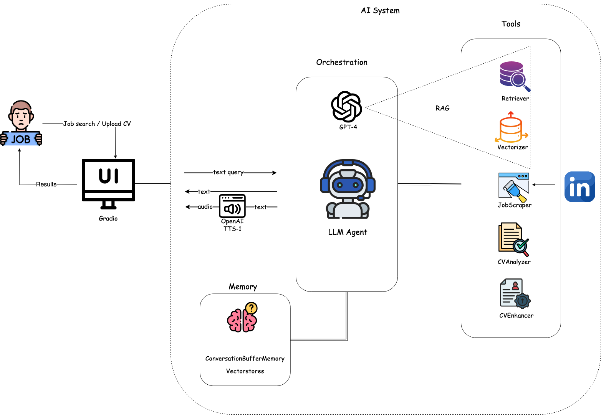

# AI-Powered Job Search Assistant

## Overview

The AI Job Search Assistant is an interactive, multi-purpose application that helps users search for jobs in real time, analyse their CVs, and get advanced ATS (Application Tracking System) and Match scores to improve their job application materials using AI and Large Language Models. Built on top of Gradio and LangChain with the support of OpenAI's GPT-4 Turbo model, the system uses various custom tools to deliver a conversational experience. The assistant provides job search/filtering capabilities, offers advanced CV analysis and targeted improvement suggestions — all while keeping a conversational memory for context.


## Table of Contents
<!-- toc -->

* [Features](#features)
* [Description](#description)
* [Architecture](#architecture)
* [Q&A Agent Details](#qa-agent-details)
* [Installation](#installation)

<!-- toc stop -->

## Features
- 🔍 Job Discovery: Scrape and index job postings from sources like LinkedIn.
- 📄 CV Analysis: Evaluate resumes via keyword matching, semantic similarity, and LLM scoring.
- 💡 Improvement Suggestions: Provide targeted recommendations to enhance your CV.
- 🔄 Follow-Up Retrieval: Seamlessly filter and rank previously stored job listings via similarity search.
- 🗣️ Conversational Interface: Engage in natural, context-aware dialogue through a Gradio chat interface.
- 🎤 Text-to-Speech: Listen to responses with integrated TTS support.

## Description
This application is designed to act as a virtual job search and CV consultation assistant. It combines job searching through scraping LinkedIn job posts, advanced filtering via text vectorisation and similarity search, CV analysis with job description matching, and AI-powered recommendations to help job seekers optimise their applications.  

The key functionalities include:

- **New Job Discovery:**  
    The assistant scrapes job postings (e.g., from LinkedIn) and uses a vectoriser that indexes and stores the job data in a vectorstore. This indexing allows the assistant to later retrieve and rank job listings.
    
- **Existing Job Retrieval and Filtering:**  
    Once job listings have been stored, follow-up queries that refer to these listings automatically trigger a retriever tool. This tool performs a similarity search using vector-based methods. By comparing the user’s query against the indexed job listings (through semantic similarity on embeddings), the retriever efficiently filters and ranks the listings based on relevance, ensuring that the most appropriate job opportunities are returned.

- **CV Analysis and Enhancement:**
    - **CV Evaluation:**  
     The assistant employs a dedicated CV analyser tool to assess how well a candidate’s resume aligns with a provided job description. Users can upload their CVs (typically in PDF format), and the tool processes the document by extracting text and performing multi-dimensional analysis. It computes:

      - Keyword Matching Score: Measures the presence and frequency of both required and preferred keywords from the job description within the CV, providing a direct metric of skill and experience alignment using NLP (Spacy). 
      - Semantic Similarity Score: Utilises advanced embedding techniques to gauge the contextual and semantic closeness between the CV and the job description, ensuring that related skills and synonyms are accurately captured.
      - LLM (Language Model) Score: Leverages GPT-4 to evaluate overall clarity, structure, and relevance of the CV content, offering an additional layer of nuanced assessment.
      
      These individual scores are then combined into a composite ATS (Applicant Tracking System) score, along with further metrics such as structured analysis and detailed breakdowns of strengths and areas for improvement. The final output is a comprehensive report that presents an overall match percentage but also provides actionable insights for enhancing the CV.     
    - **Improvement Suggestions:**  
    After the initial analysis, the user is prompted for improvement suggestions. On confirmation, the CV enhancer tool provides targeted recommendations focusing on areas such as professional summary, work experience, skills, format, and achievements.

- **Conversational Interface:**  
  * A chat interface powered by Gradio allows users to interact naturally with the assistant
  * The system maintains conversation history via LangChain’s memory modules, ensuring contextual understanding and enabling coherent multi-turn interactions.
  
  Additional Features:
    * Text-to-Speech: The assistant can also read its responses aloud using OpenAI’s TTS capabilities.
    * File Handling: Users can upload CV files (PDF), which are processed and analysed

## Architecture




## Q&A Agent Details

General Architecture:
The agent is built with LangChain framework and initialised using the `initialize_agent` function. It is configured with several custom tools for job scraping `LinkedInJobScraperTool`, vectorisation `VectorizeTool`, information retrieval `RetrieverTool`, CV analysis `CVAnalyzerTool`, and CV enhancement `CVEnhancerTool`. The agent acts as the central orchestrator—receiving user queries, invoking the proper tool, and maintaining conversation context, while using OpenAI's GPT-4 as base model. 

Memory:
The application leverages LangChain’s ConversationBufferMemory and ChatMessageHistory to store and manage the chat history. This memory helps maintain context between interactions, so follow-up queries (e.g., referring to previously provided job listings) are properly handled.

PromptTemplate:
The agent uses a carefully designed ChatPromptTemplate that includes:
- A system message describing the assistant’s role and the specific instructions for handling job search, CV analysis, and improvement suggestions.
- Placeholders for chat history and dynamic user input.
- A human message prompt that captures the user’s query. This template ensures that the assistant consistently follows the desired conversational flow and business logic.


## Installation

# A. Using a Python Virtual Environment

1.  Fork the repository [here](https://github.com/mkoskinas/Job-Search-AI-Agent/fork).

2. Clone the forked repository.
```bash
git clone https://github.com/<YOUR-USERNAME>/Job-Search-AI-Agent.git
cd Job-Search-AI-Agent
```

3. Create the environment:

```bash
python -m venv rag_env
```

4. Activate the Virtual Environment.

- On Windows.

```bash
env\Scripts\activate
```

- On macOS and Linux.

```bash
source env/bin/activate
```

5. Install Dependencies:

```bash
pip install -r requirements.txt
```

6. Download SpaCy language model

```bash
python -m spacy download en_core_web_sm
```

7. Create a `.env` file in the project root and add your OpenAI API key:

```bash
OPENAI_API_KEY=your_api_key_here
```

8. Run the application:

```bash
python main.py
```

9. Access the web interface at `http://127.0.0.1:7861`

OR

# B. Using Anaconda

1.  Fork the repository [here](https://github.com/mkoskinas/Job-Search-AI-Agent/fork).

2. Clone the forked repository.
```bash
git clone https://github.com/<YOUR-USERNAME>/Job-Search-AI-Agent.git
cd Job-Search-AI-Agent
```
3. Create and activate the environment:

```bash
# Create environment from yml file
conda env create -f environment.yml

# Activate the environment
conda activate rag_env

# For future updates to the environment
conda env update -f environment.yml
```

4. Install spaCy language model:
```bash
python -m spacy download en_core_web_sm
```

5. Set up environment variables:
Create a `.env` file in the root directory with:
```bash
OPENAI_API_KEY=your_openai_api_key
```

6. Run the application:
```bash
python main.py
```

7. Access the web interface at `http://127.0.0.1:7861`
